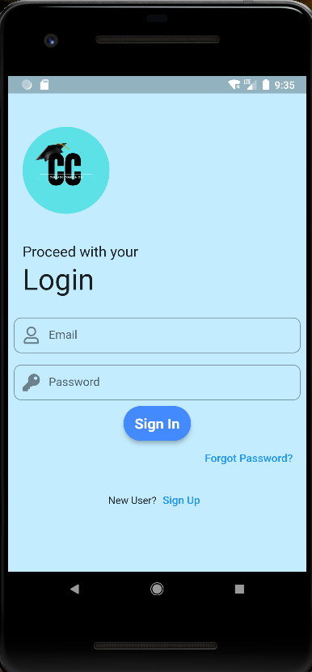
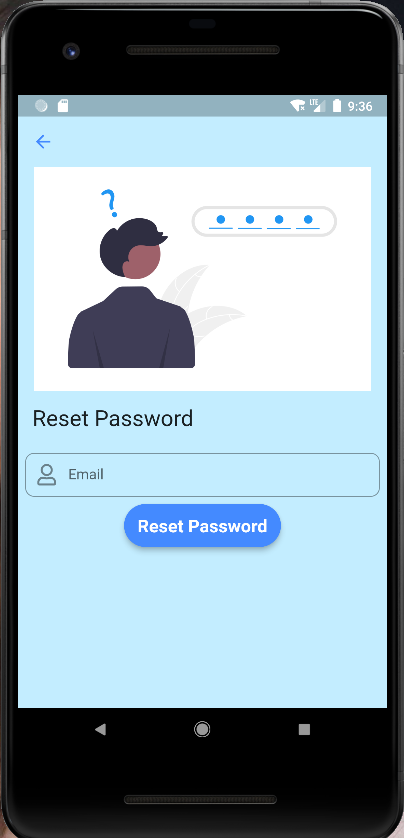
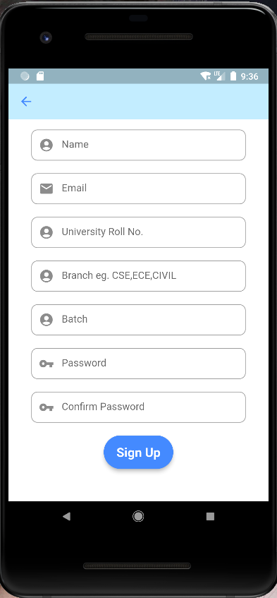
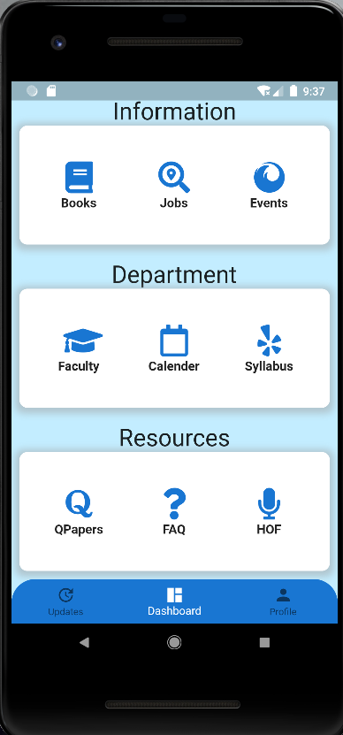
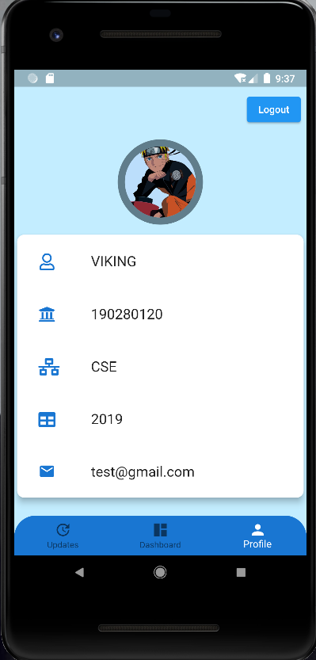

----------This Project is a Universirty App---------- -->
Built in flutter using firebase for backend.

<h2>Login Page</h2> 
 
<h2>Reset Password Page</h2> 
 
<h2>Sign Up Page<h2> 
 
<h2>Home Page<h2> 
 
<h2>Profile Page</h2>
 

Features
 -->Academic Calander 
-->E-Books 
-->Events 
-->FAQ 
-->Faculty Data 
-->Hall Of Fame 
-->Previus Question Papers 
-->Syllabus 
